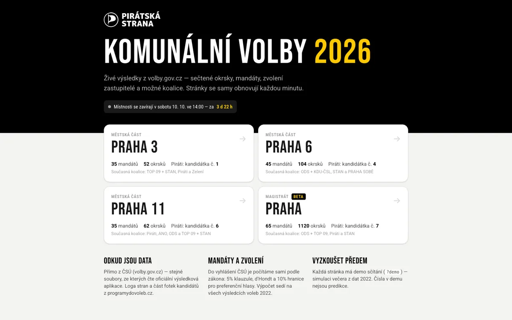
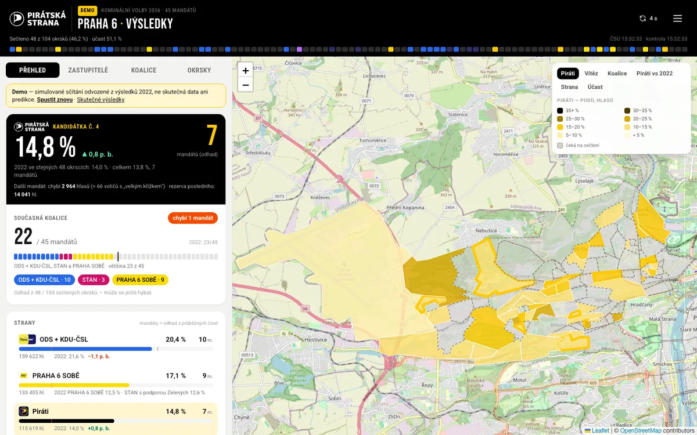
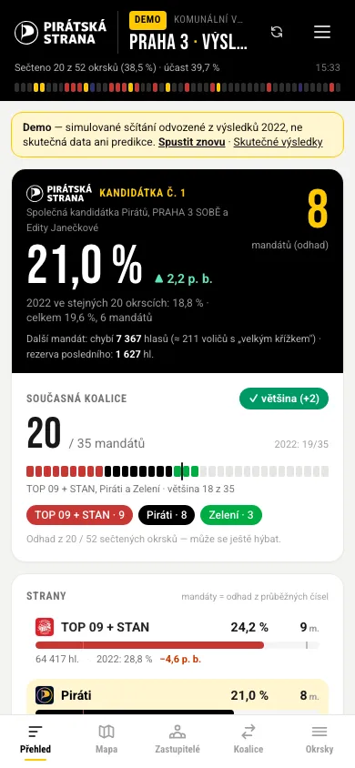
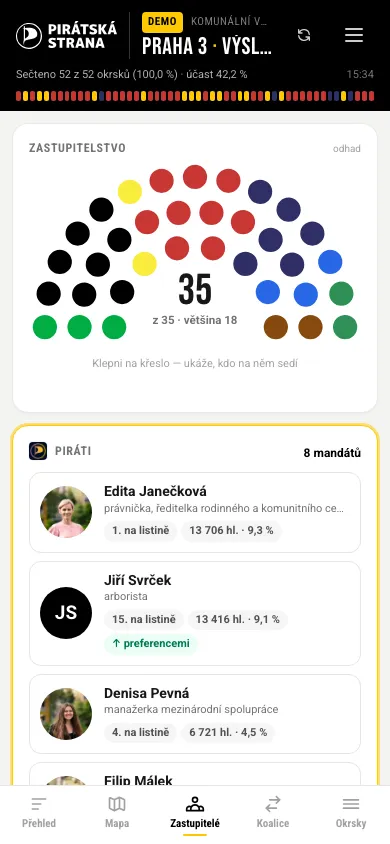

# Volby 2026 — živé výsledky (Piráti Praha)

Webová aplikace pro sledování průběžných výsledků **komunálních voleb
9.–10. října 2026** ve všech pražských zastupitelstvech — Magistrát a všech
57 městských částí. Data bere přímo z ČSÚ (volby.gov.cz), sama se obnovuje
a ukazuje, co nás ve volební noc zajímá: kolik mají Piráti v každé MČ, kdo by
byl zvolen, jestli drží současná koalice a s kým se dá skládat většina.

Přehled (`/`) ukazuje souhrn za celou Prahu a u každé MČ, kde kandidujeme,
průběžné procento a mandáty Pirátů už během sčítání. Každé zastupitelstvo má
svou stránku `/<slug>` (`/praha-7`, `/praha-dolni-chabry`, …).

Piráti kandidují na Magistrátu a ve 21 MČ:

| Zastupitelstvo | Adresa | Mandátů | Okrsků | Pirátská kandidátka |
|---|---|---|---|---|
| Hl. m. Praha (Magistrát) | `/praha` | 65 | 1 120 | č. 7 Česká pirátská strana — **beta**, bez mapy okrsků, viz [docs/MAGISTRAT.md](docs/MAGISTRAT.md) |
| Praha 1 | `/praha-1` | 27 | 21 | č. 13 Piráti a nezávislí pro Prahu 1 |
| Praha 2 | `/praha-2` | 35 | 41 | č. 8 Česká pirátská strana |
| Praha 3 | `/praha-3` | 35 | 52 | č. 1 Piráti, PRAHA 3 SOBĚ a Edita Janečková |
| Praha 4 | `/praha-4` | 45 | 132 | č. 2 Česká pirátská strana |
| Praha 5 | `/praha-5` | 41 | 81 | č. 8 Česká pirátská strana |
| Praha 6 | `/praha-6` | 45 | 104 | č. 4 Česká pirátská strana |
| Praha 7 | `/praha-7` | 29 | 36 | č. 6 Piráti a Starostové |
| Praha 8 | `/praha-8` | 45 | 106 | č. 6 Česká pirátská strana |
| Praha 9 | `/praha-9` | 33 | 43 | č. 7 Česká pirátská strana |
| Praha 10 | `/praha-10` | 45 | 109 | č. 7 Česká pirátská strana |
| Praha 11 | `/praha-11` | 35 | 62 | č. 6 Česká pirátská strana |
| Praha 12 | `/praha-12` | 35 | 50 | č. 9 Piráti Praha 12 |
| Praha 13 | `/praha-13` | 35 | 58 | č. 5 Zelení a Piráti pro 13 |
| Praha 14 | `/praha-14` | 31 | 32 | č. 7 MY pro Prahu 14 - Piráti, Praha 14 sobě, Zelení |
| Praha 15 | `/praha-15` | 31 | 23 | č. 9 Piráti a Praha 15 sobě |
| Praha 16 | `/praha-16` | 15 | 8 | č. 4 Piráti a nezávislí kandidáti |
| Praha 18 | `/praha-18` | 23 | 12 | č. 6 Zdravé Letňany |
| Praha 22 | `/praha-22` | 25 | 9 | č. 4 Česká pirátská strana |
| Praha-Petrovice | `/praha-petrovice` | 15 | 4 | č. 5 Žijeme Petrovice |
| Praha-Řeporyje | `/praha-reporyje` | 15 | 3 | č. 3 PŘÍVĚTIVÉ ŘEPORYJE |
| Praha-Zbraslav | `/praha-zbraslav` | 17 | 10 | č. 2 100pro Zbraslav |

Ve zbylých 36 MČ (Praha 17, 19, 20, 21 a menší MČ) Piráti nemají vlastní
kandidátku — jejich stránky ukazují výsledky všech kandidátek. Ve čtyřech
z nich kandidují členky Pirátů na kandidátkách místních uskupení (Dolní
Měcholupy, Klánovice, Kunratice, Suchdol — `pirateCandidates` v
`src/councils.js`); přehled je ukazuje ve vlastní sekci nad ostatními MČ
a jejich stránky mají kartu s naší kandidátkou.
Současnou koalici máme zadanou jen u Prahy 3, 6, 11 a Magistrátu (viz
Konfigurace); jinde se karta koalice a režim mapy „Koalice" neukazují.



## Co aplikace umí

- **Přehled celé Prahy** (`/`) — kolik mandátů mají Piráti dohromady ve
  všech MČ a na Magistrátu, karta každé MČ s Piráty (procento, mandáty,
  pořadí, sečtené okrsky, pruh mandátů všech stran, co chybí na další mandát
  nebo přes 5% klauzuli), řazení podle MČ / procent / mandátů. Pod nimi MČ,
  kde jsou Piráti na kandidátce jiného uskupení (výsledek kandidátky,
  preferenční hlasy a odhad mandátu naší kandidátky), a ostatní MČ s tím,
  kdo vede. Čerstvě změněné MČ krátce zablikají. Demo `/?demo`.
- **Živé výsledky** — sečtené okrsky, účast, hlasy a procenta stran, automatické
  obnovení každou minutu (ČSÚ data stejně cachuje 60 s), odpočet do další
  kontroly („obnoví se samo za 0:45"). Obnovit ručně (tlačítkem i reloadem
  stránky) jde až po jeho vypršení. Při první návštěvě krátký průvodce
  ([`WelcomeGuide`](src/components/WelcomeGuide.jsx), jednou na prohlížeč):
  stránka se obnovuje sama, ruční obnovení nic nezrychlí.
- **Verze a automatické aktualizace** — po nasazení nové verze se otevřené
  stránky samy obnoví a jednou ukážou „Co je nové" (viz Verzování).
- **Mandáty a zvolení** — do vyhlášení ČSÚ vlastní výpočet podle zákona
  (5% klauzule s přepočteným základem, d'Hondt, 10% hranice preferenčních
  hlasů); po vyhlášení oficiální čísla. Půlkruh zastupitelstva — klepnutím na
  křeslo uvidíš, kdo na něm sedí.
- **Piráti v centru** — hero karta s procenty, mandáty, změnou proti roku
  2022 (jen ve stejných sečtených okrscích), kolik hlasů chybí na další
  mandát a jaká je rezerva posledního. Karty zvolených s fotkami, „na hraně"
  a pořadí podle preferenčních hlasů.
- **Koalice** — kolik má současná koalice, skládačka vlastní koalice a seznam
  všech minimálních většin (filtr „jen s Piráty").
- **Mapa okrsků** — podíl Pirátů (pirátská žlutá škála), vítěz okrsku,
  současná koalice, změna proti 2022, libovolná strana, účast. Náhled po
  najetí myší, detail po kliknutí, čerstvě sečtené okrsky zablikají. Před
  sčítáním mapa ukazuje KV 2022.
- **Okrsky v pořadí, jak je komise posílají** — feed sečtených okrsků.
- **Loga stran a barvy** z programydovoleb.cz, fotky kandidátů (vlastní +
  programydovoleb.cz).
- **Demo sčítání** — `?demo` (nebo `?demo=60` = délka v sekundách) přehraje
  celý večer na datech 2022. Čísla v demu nejsou predikce.
- **Mobil first** — spodní lišta záložek, mapa přes celou obrazovku, bottom
  sheet s detailem okrsku. Mobilní rozložení dostane i telefon na šířku
  (`MOBILE_QUERY` v [`useIsMobile.js`](src/hooks/useIsMobile.js) = varianta
  `mobile:` v [`index.css`](src/index.css) — držet v souladu). Dotykové cíle
  aspoň 40–44 px, záložky si pamatují vlastní pozici scrollu a otevřená
  záložka + vybraný okrsek jsou v URL (`#mapa:3021`), takže přežijí vynucené
  obnovení po nasazení. Mapa (MapLibre + Leaflet) se stahuje zvlášť, přehled
  ji nenačítá. **Na telefonu je mapa ve výchozím stavu vypnutá** (~1 MB dat
  + dlaždice při posunu): záložka Mapa nabídne „Zapnout mapu", vypnout jde
  v mapě nebo přepínačem v menu, volba je v `localStorage`
  ([`useMapPreference.js`](src/hooks/useMapPreference.js)). Bez mapy se detail
  okrsku otevře jako spodní panel nad seznamem okrsků.

| Desktop (Praha 6, demo) | Mobil (Praha 3, demo) |
|---|---|
|  |   |

## Rychlý start (lokálně)

Potřebuješ **Node.js 20+** (doporučeno 22/24) a npm.

```bash
git clone <repo> pirati-vysledky-2026
cd pirati-vysledky-2026
npm install
npm run dev
```

Otevři <http://localhost:5173>:

- `http://localhost:5173/praha-3?demo` — demo sčítání (nejlepší na vyzkoušení),
- `http://localhost:5173/praha-6` — skutečná data z volby.gov.cz (před
  sobotou 14:00 jen kandidátky a odpočet).

Vite dev server pouští i serverovou funkci `api/volby.js` (plugin ve
`vite.config.js`), takže lokálně funguje stejná cesta jako na Vercelu.
Statická data jsou v repu — `npm run data` je potřeba jen při jejich obnově.

### Příkazy

| Příkaz | Co dělá |
|---|---|
| `npm run dev` | vývojový server (včetně `/api/volby`) |
| `npm run build` | produkční build do `dist/` |
| `npm run preview` | náhled buildu (bez `/api` — klient pak čte rovnou z volby.gov.cz) |
| `npm run lint` | ESLint |
| `npm run data` | znovu vygeneruje `public/data/` a `public/media/` (všech 58 zastupitelstev + `prehled.json`) |
| `npm run data -- praha-6` | jen jedno zastupitelstvo; `--fresh` ignoruje cache stažených souborů |
| `npm run verify` | ověří výpočet mandátů na oficiálních výsledcích 2022; `-- --all` na celé ČR |

## Jak funguje stahování výsledků

ČSÚ nemá veřejné API — jeho výsledková aplikace (`volby.gov.cz/app/kv2026`)
čte statické JSONy z `https://volby.gov.cz/appdata/kv2026/20261009/…`
(CORS `*`, ETag, webcache 60 s). Čteme stejné soubory:

| Soubor | Obsah | Kdy se stahuje |
|---|---|---|
| `vysled/1100/<zastup>.json` | souhrn: přehled, strany, hlasy kandidátů, po vyhlášení mandáty | každé kolo (podmíněně, většinou 304) |
| `ucast/obec/1100/<zastup>.json` | účast po okrscích = které okrsky jsou sečtené | každé kolo (podmíněně) |
| `vysled/okrsek/1100/<zastup>_<okrsek>.json` | výsledek jednoho okrsku | jen jednou, když okrsek přibude (nebo když ho ČSÚ opraví) |

Významy sloupců jsou zdokumentované v [`src/volby/feed.js`](src/volby/feed.js)
(vyčtené z kódu aplikace ČSÚ, formát ověřený na hotových datech KZ 2024).

Přehled (`/api/prehled`, [`src/volby/overview.js`](src/volby/overview.js))
čte jen souhrnné soubory `vysled/1100/<zastup>.json` všech 58 zastupitelstev
a z každého pošle stav sčítání, hlasy a mandáty stran (oficiální, nebo náš
odhad) a výsledek Pirátů — celá odpověď má ~15 KB (~3–4 KB komprimovaně).

```
prohlížeče ──(1×/min)──▶ CDN Vercelu ──(~2×/min/zastupitelstvo)──▶ api/volby.js ──(ETag, 304)──▶ volby.gov.cz
     │                        └─────────(~2×/min)──────────────────▶ api/prehled.js ─(58 souborů)─┘   ▲
     └──────────────── záloha, když naše API 2× po sobě selže (CORS povolen) ───────────────────────┘
```

Záloha přehledu přímo z prohlížeče čte jen 26 zastupitelstev s Piráty
(včetně Pirátů na jiných kandidátkách) a nejvýš jednou za 2 minuty.

### Šetrnost ke kapacitě

- **Jedna sdílená odpověď pro všechny.** `api/volby.js?z=<kód>` vrací snapshot
  s `Cache-Control: s-maxage=30, stale-while-revalidate=60, stale-if-error=900`.
  Diváky obslouží CDN; funkce běží zhruba 2× za minutu za zastupitelstvo bez
  ohledu na počet lidí. Před 14:00 s-maxage až 5 min, po vyhlášení 10 min.
- **Klient podle fáze** ([`useLiveResults`](src/hooks/useLiveResults.js)):
  před 14:00 jednou za 10 min (a probudí se přesně na uzavření místností),
  při sčítání 60 s ± 15 % jitter, po vyhlášení 15 min. Ve skryté záložce
  nic, při chybách backoff až na 10 min. **Ruční obnovení až po vypršení
  odpočtu** do další kontroly: tlačítko je do té doby ztlumené a po kliknutí
  jen řekne, za kolik to půjde. Reload stránky před koncem odpočtu nic
  nestahuje — poslední snapshot a čas další kontroly drží `sessionStorage`
  (`kv26.snap.*`), stránka je ukáže a počká na plánovaný čas.
- **Ochrana zdroje.** Podmíněné dotazy (ETag), okrsky jen nové, časové
  limity (8 s funkce / 15 s prohlížeč), po chybě se soubor znovu zkouší až
  po intervalu a souběžné dotazy na stejný soubor se sdílí. Na okrskové
  soubory funkce čeká max. 3 s — zbytek doběhne na pozadí.
- **Whitelist.** Proxy obslouží jen zastupitelstva ze `src/councils.js`.
- **Odolnost.** Výpadek zdroje → poslední data se štítkem OFFLINE. Výpadek
  naší funkce → prohlížeč čte rovnou z volby.gov.cz. Nenačte se nic →
  stránka ukáže aspoň kandidátky, odpočet a výchozí stav 2022.

### Kapacita a náklady (odhad)

Velikost jedné odpovědi při plném sčítání (komprimovaně, brotli):
Praha 3 **9 KB**, Praha 6 **15 KB**, Praha 11 **10 KB**, Magistrát **25 KB**
(bez okrsků), přehled **~4 KB**. První načtení stránky ≈ 0,5–0,8 MB (JS
~430 KB gzip, data, loga; fotky jen na záložce Zastupitelé).

| Scénář: 6 h sledování | CDN requesty | Přenos | Funkce | Zdroj volby.gov.cz |
|---|---|---|---|---|
| 5 000 diváků celkem | ~1,8 mil. | ~35 GB | ≤ 2 spuštění/min na sledované zastupitelstvo + přehled, < 30 min CPU | ≤ ~350 podmíněných dotazů/min (většinou 304) + ~1 100 okrskových souborů za noc |
| 20 000 diváků celkem | ~7 mil. | ~130 GB | stejně | stejně |

Na **Vercel Pro** (10 mil. requestů a 1 TB přenosu v ceně) je to ve všech
scénářích 0 Kč navíc. Na Hobby (zhruba 1 mil. requestů / 100 GB měsíčně)
by velký scénář narazil — projekt proto patří do placeného týmu. Počet
spuštění funkce a zátěž volby.gov.cz na počtu diváků **nezávisí** — jen na
tom, kolik zastupitelstev má aspoň jednoho diváka (horní mez = všech 58
+ přehled, který sám čte 58 souborů ~2× za minutu).

## Data

Generuje je `npm run data` ([`scripts/build-data.js`](scripts/build-data.js)) do
`public/data/<slug>/` a `public/media/<slug>/`:

| Soubor | Obsah | Zdroj |
|---|---|---|
| `lists.json` | kandidátky 2026: název, složení, barva, loga, web, předchůdce 2022 | registr KV 2026 (ČSÚ), programydovoleb.cz |
| `kandidati.json` | kandidáti: jméno, tituly, věk, povolání, příslušnost, fotka | registr KV 2026, jmenný seznam volby.gov.cz |
| `results2022.json` | KV 2022 po okrscích: voliči, obálky, hlasy kandidátek | open data KV 2022 (ČSÚ) |
| `okrsky.geojson` | hranice okrsků (WGS84, zjednodušené) | ČSÚ, okrsky 2025 (S-JTSK → WGS84) |
| `media/*/logos`, `photos` | loga a fotky (WebP, zmenšené) | programydovoleb.cz, vlastní fotky |
| `data/prehled.json` | za každé zastupitelstvo kandidátky (zkratky, barvy, počty kandidátů) a výsledek předchůdců 2022 — podklad přehledu `/` | skládá se z hotových `lists.json` |

**Předchůdci 2022** se párují automaticky podle složení stran (kódy ČSÚ,
bez nezávislých): kandidátka 2026 ← kandidátky 2022, se kterými sdílí
stranu. Když se kandidátka 2022 rozdělila mezi víc kandidátek 2026 (např.
KDU-ČSL + ODS na Praze 3, STAN se Zelenými na Praze 6), změna v p. b. se
nepočítá — UI ukáže jen informativní „2022: …". Sdružení nezávislých
kandidátů žádnou stranu nemají — ta se párují podle stejného názvu
(PRAHA 7 SOBĚ, SOS Suchdol, …), pokud kandidátku 2022 nemá jiná. Výsledek
párování vypíše `npm run data` do konzole (`(podle názvu)`).

**Barvy:** Piráti vždy černí (v mapě pirátská žlutá škála), ostatní barva
kandidátky z programydovoleb.cz → barva strany → paleta; podobné barvy se
přidělí podle váhy strany v roce 2022. Ruční výjimky v `src/councils.js`.

## Konfigurace: `src/councils.js`

Jediné místo s ručně zadaným politickým kontextem. Má dvě části:

- **`PRAHA`** — tabulka všech 58 zastupitelstev vygenerovaná z registrů ČSÚ
  (slug, kód, název, mandáty, okrsky, číslo pirátské kandidátky; `null` =
  Piráti nekandidují). Kandidátky jsou od 2. 10. konečné, ručně se nemění.
- **`DETAIL`** — ruční kontext podle slugu (zatím Praha 3, 6, 11, Magistrát):
  - `coalition` — současná koalice (čísla kandidátek 2026) a kolik měla
    mandátů v roce 2022; bez ní stránka kartu koalice nezobrazí,
  - `lists` — zkrácené názvy (`short`, `tiny`), poznámka, případně barva
    (jinak zkratky z registru ČSÚ; společná pirátská kandidátka dostane
    poznámku s výčtem členů automaticky),
  - `photos` — vlastní fotky (`public/media/<slug>/photos/`),
  - `map`, `precinctFiles`, `title`, `beta` — u Magistrátu mapa vypnutá,
  - `pirateCandidates` — členové Pirátů na kandidátce jiného uskupení v MČ
    bez pirátské kandidátky (`{ list, n, name }`, podle příslušnosti
    „Piráti" v `kandidati.json`); přehled pro ně počítá preferenční hlasy
    a odhad mandátu.

Koalici další MČ doplníš přidáním `'<slug>': { coalition: { lists, label,
seats2022, seatsTotal2022 } }` do `DETAIL` — nic dalšího měnit netřeba.

> ⚠️ **Koalice jsou podle zpráv z let 2022–2023** (Praha 6: ODS + KDU-ČSL,
> STAN, PRAHA 6 SOBĚ; Praha 11: Piráti, ANO, ODS, TOP 09 + STAN; Magistrát:
> SPOLU, Piráti, STAN). Pokud se během volebního období změnily, uprav
> `coalition.lists` — nic dalšího měnit netřeba.

### Přidání dalšího zastupitelstva (mimo Prahu)

1. Najdi kód zastupitelstva (`KODZASTUP`) — např. v
   `https://volby.gov.cz/appdata/kv2026/20261009/navig/obce/<okres>.json`.
2. Přidej řádek do tabulky (pozor, `okres` je zatím pevně 1100 — rozšířit
   o sloupec). Počet mandátů a okrsků ověř v `vysled/<okres>/<zastup>.json`
   (`prehled[0]`, `prehled[2]`).
3. Slug musí projít rewritem ve `vercel.json` (`praha`, `praha-*`).
4. `npm run data -- <slug>` a zkontroluj výpis (párování 2022, barvy, loga).
5. `npm run verify` a `/<slug>?demo`.

Hranice okrsků se filtrují podle `kod_mco` (MČ) nebo `kod_obec`
— viz `buildCouncil()` ve skriptu.

## Verzování a changelog

Stejně jako v p3-analyza: zdroj pravdy je **`src/changelog.js`** — pole
`CHANGELOG` (nejnovější verze první); verze prvního záznamu je aktuální
verze aplikace (`APP_VERSION`).

**Vydání nové verze = přidat záznam na začátek `CHANGELOG`** (verze, datum,
titulek, položky s typem `new`/`improved`/`fixed`) a nasadit. Nic víc.
Verzi v `package.json` udržujte synchronizovanou (jen informativně).

Jak to funguje:

- Vite plugin ve `vite.config.js` při buildu vygeneruje `dist/version.json`
  s aktuální verzí (v dev serveru se servíruje on-the-fly). Pro
  `/version.json` je ve `vercel.json` nastaveno `Cache-Control: no-store`.
- `src/hooks/useUpdateCheck.js` na klientu kontroluje `/version.json` každých
  5 minut a při návratu okna do popředí (nejvýš 1× za minutu) — ne každou
  minutu, ať se ve volební noc nezdvojnásobí počet dotazů. Když se nasazená
  verze liší od běžícího bundlu, `src/components/UpdateManager.jsx`
  (mountovaný v `main.jsx` nad všemi stránkami) ukáže toast a **vynutí
  reload** — na verzi jen jednou za session (pojistka proti smyčce; pak
  zůstane tlačítko „Obnovit").
- Changelog je dostupný přes „Co je nové" v menu stránek zastupitelstev
  a v patičce přehledu. Po první návštěvě v nové verzi se uživateli jednou
  automaticky ukáže přehled novinek od jeho poslední viděné verze
  (`localStorage.kv26_seen_version`).

## Nasazení

**Produkce běží na Cloudflare Workers** (`cloudflare/`, viz
[cloudflare/README.md](cloudflare/README.md)) a **nasazuje se automaticky:**
každý push do `main` spustí GitHub Action
[`deploy.yml`](.github/workflows/deploy.yml) — lint, build, `wrangler
deploy`, ověření nasazené verze (`/version.json`). Produkce tak vždy odpovídá
`main`. Ručně: GitHub → Actions → Deploy → Run workflow, nebo lokálně
`npm run deploy` ve složce `cloudflare/`.

Produkce: <https://pirati-vysledky-2026.pirati-vysledky-2026-cloudflare.workers.dev>

| Kde | Secret | K čemu |
|---|---|---|
| GitHub repo (Settings → Secrets → Actions) | `CLOUDFLARE_API_TOKEN` | nasazení z GitHub Action (šablona tokenu „Edit Cloudflare Workers") |
| Cloudflare Worker (`npx wrangler secret put GITHUB_TOKEN` v `cloudflare/`) | `GITHUB_TOKEN` | brouk zakládá issues (fine-grained token jen na tohle repo, Issues: Read and write) |

V repu žádné klíče nejsou — `account_id` ve `wrangler.jsonc` není tajný.

Ověření cache — druhý dotaz musí vrátit `x-cache: HIT`:

```bash
curl -sI "https://<doména>/api/prehled" | grep -i x-cache
curl -sI "https://<doména>/api/volby?z=500097" | grep -i x-cache
```

### Alternativa: Vercel

Aplikace jde nasadit i na Vercel (`vercel.json` je udržovaný: rewrite slugů,
funkce, hlavičky) — `vercel link` a `vercel deploy --prod`. Brouk tam
zakládá issues bez screenshotů (úložiště je jen na Cloudflare). Cache ověř
přes `x-vercel-cache`.

## Nahlášení chyby (brouk)

Plovoucí tlačítko vpravo dole na všech stránkách
([`BugReportWidget`](src/components/BugReportWidget.jsx)) — na mobilu při
rolování dolů uhne, ať nezakrývá čísla, a při otevřeném detailu okrsku se
schová (`body[data-sheet]`): název, popis
a volitelný screenshot (přetažením, výběrem souboru nebo Ctrl+V; zmenší se
na JPEG ≤ 1600 px / 3 MB). Odešle se na `/api/bug`
([`api/bug.js`](api/bug.js)), které založí **issue v tomhle repu** s labely
`bug` a `z-aplikace` — přidá adresu stránky, verzi aplikace, prohlížeč
a zařízení. Token GitHubu je jen na serveru.

- Proti spamu: honeypot, časová past (formulář za < 2 s = robot, dostane
  falešné „OK"), limit 5 hlášení / 15 min / IP.
- Screenshoty ukládá worker do Workers KV (`HLASENI`) a servíruje je na
  `/hlaseni/<rok>/<měsíc>/<uuid>.jpg` — v issue se zobrazí jako obrázek.
- Bez `GITHUB_TOKEN` vrací endpoint 503 „Nahlašování chyb zatím není
  nastavené" (lokální dev bez tokenu, Vercel bez env).

### Checklist na volební den

- [ ] Do čtvrtka nasazeno na produkci (poslední běh Actions → Deploy zelený), prošlé `/<slug>?demo` na mobilu i desktopu.
- [ ] Koalice v `src/councils.js` odpovídají realitě.
- [ ] `x-cache: HIT` na `/api/prehled` a na `/api/volby?z=…` (aspoň Magistrát a MČ s Piráty).
- [ ] Brouk: testovací hlášení se screenshotem založí issue (pak ho zavřít).
- [ ] Přehled `/?demo` na mobilu: karty MČ, řazení, souhrn mandátů.
- [ ] Mobil na šířku (`/<slug>?demo#mapa`): spodní lišta, mapa, detail okrsku vpravo.
- [ ] Mobil s vypnutou mapou: záložka Mapa → Zapnout mapu; Okrsky → klepnutí na okrsek otevře panel s detailem.
- [ ] Billing Vercel týmu v pořádku (žádná neuhrazená faktura).
- [ ] V sobotu po 14:00 první okrsky: zkontrolovat, že čísla sedí s volby.gov.cz/app/kv2026.
- [ ] Po vyhlášení mandátů ČSÚ: zkontrolovat, že se přepnulo na „oficiální mandáty".

## Ověření výpočtu

`npm run verify` přepočítá mandáty a zvolené kandidáty z oficiálních výsledků
KV 2022 a porovná je s ČSÚ:

- všech 58 pražských zastupitelstev: **58 / 58 (100 %)**, mandáty stran
  i zvolení kandidáti,
- celá ČR (`-- --all`): **6 357 z 6 384 voleb (99,58 %)**, zvolení
  kandidáti bez jediné chyby. Zbylých 27 jsou malé obce s přesnou shodou
  podílů, kterou zákon rozhoduje losem.

Neintuitivní detail: hranice pro preferenční posun je **⌊průměr hlasů na
kandidáta⌋ × 1,1** — ČSÚ zaokrouhluje průměr dolů (s přesným průměrem by
v roce 2022 nesedělo ~1 100 kandidátů).

## Struktura

```
api/volby.js              serverless proxy s CDN cache (whitelist zastupitelstev)
api/prehled.js            přehled všech zastupitelstev (souhrny, výsledek Pirátů)
api/bug.js                nahlášení chyby → GitHub issue (brouk)
api/_http.js              sdílené hlavičky / Cache-Control funkcí
cloudflare/               produkční Worker (statika, API přes Durable Object, KV screenshotů)
.github/workflows/deploy.yml  autodeploy main → Cloudflare
scripts/build-data.js     generování statických dat (ČSÚ + programydovoleb.cz)
scripts/verify-2022.js    ověření výpočtu na výsledcích 2022
src/councils.js           konfigurace zastupitelstev (ručně)
src/volby/feed.js         stahování a normalizace dat ČSÚ (server i prohlížeč)
src/volby/overview.js     souhrny zastupitelstev pro přehled + demo přehledu
src/volby/compute.js      klauzule, d'Hondt, preference, koalice, srovnání s 2022
src/volby/model.js        odvozený model pro UI
src/volby/council.js      metadata aktivního zastupitelstva (barvy, loga, osa)
src/volby/demo.js         demo sčítání
src/hooks/useLiveResults.js  polling, záloha, backoff, blokace předčasného obnovení
src/changelog.js          verze aplikace a changelog (zdroj pravdy)
src/components/UpdateManager.jsx  automatická aktualizace + „Co je nové"
src/pages/                Landing (/), CouncilApp (/<slug>)
src/components/           hlavička, mapa, strany, zastupitelé, koalice, okrsky
docs/MAGISTRAT.md         Magistrát: stav, plán, výpočetní náročnost
```

## Známá omezení

- Mandáty a zvolení jsou do vyhlášení ČSÚ **odhad** z průběžných čísel —
  první sečtené okrsky nemusí být reprezentativní (UI to píše).
- Sloupec „zvolen" v datech ČSÚ šel před volbami ověřit jen z kódu jejich
  aplikace; použije se jen tehdy, když počet zvolených sedí s mandáty strany.
- Hranice okrsků jsou z roku 2025 (u Magistrátu chybí nový okrsek 34004);
  srovnání s 2022 po okrscích předpokládá stejná čísla okrsků.
- Časy v přehledu okrsků = kdy okrsek poprvé viděl daný prohlížeč.
- Fotky kandidátů jen tam, kde je máme (vlastní / programydovoleb.cz),
  ostatní mají iniciály.

## Zdroje a licence

- Výsledky, registry, hranice okrsků: **Český statistický úřad** (volby.gov.cz),
  [podmínky užití](https://csu.gov.cz/podminky_pro_vyuzivani_a_dalsi_zverejnovani_statistickych_udaju_csu).
- Loga stran, barvy a část fotek kandidátů: **programydovoleb.cz**.
- Podkladová mapa: **OpenFreeMap** (Positron), © přispěvatelé
  **OpenStreetMap**; záloha bez WebGL2: dlaždice OpenStreetMap.
- Logo a vizuální styl: **Česká pirátská strana** (pirati.cz).
